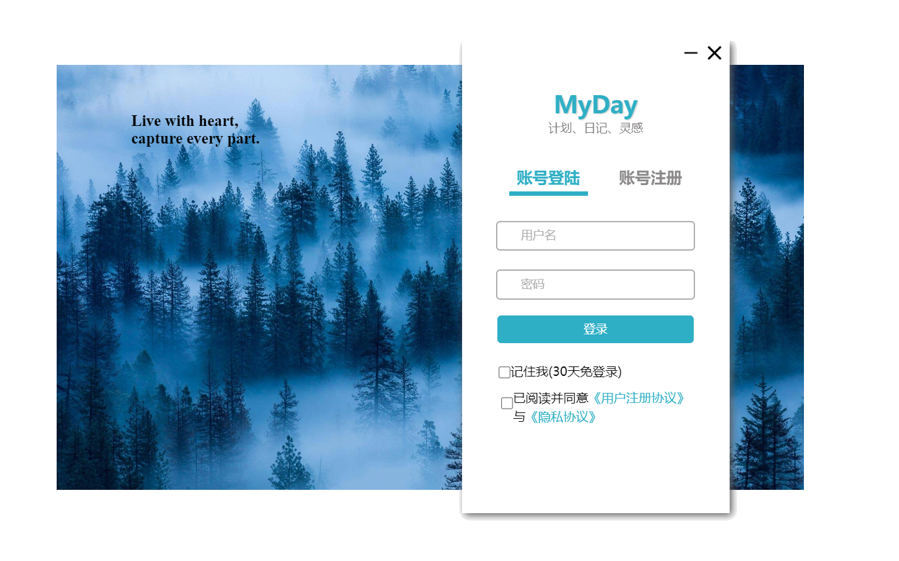
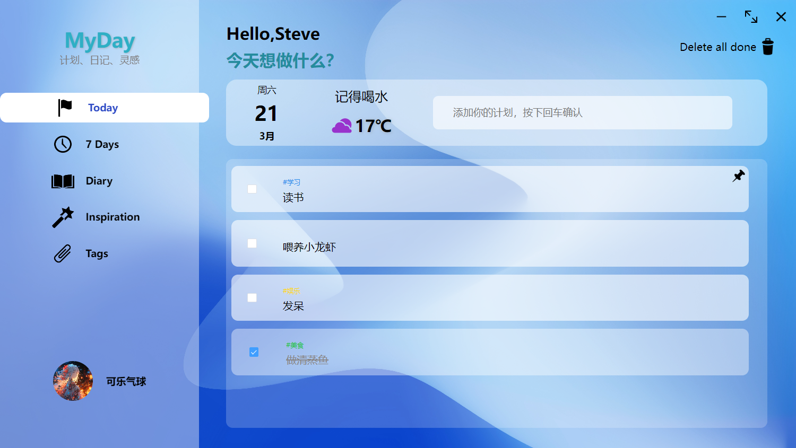
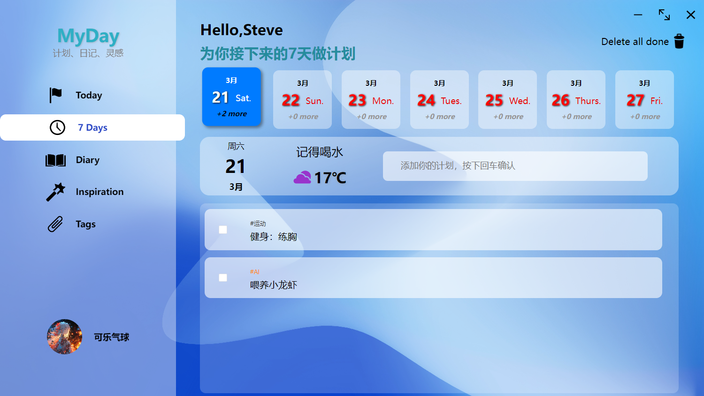
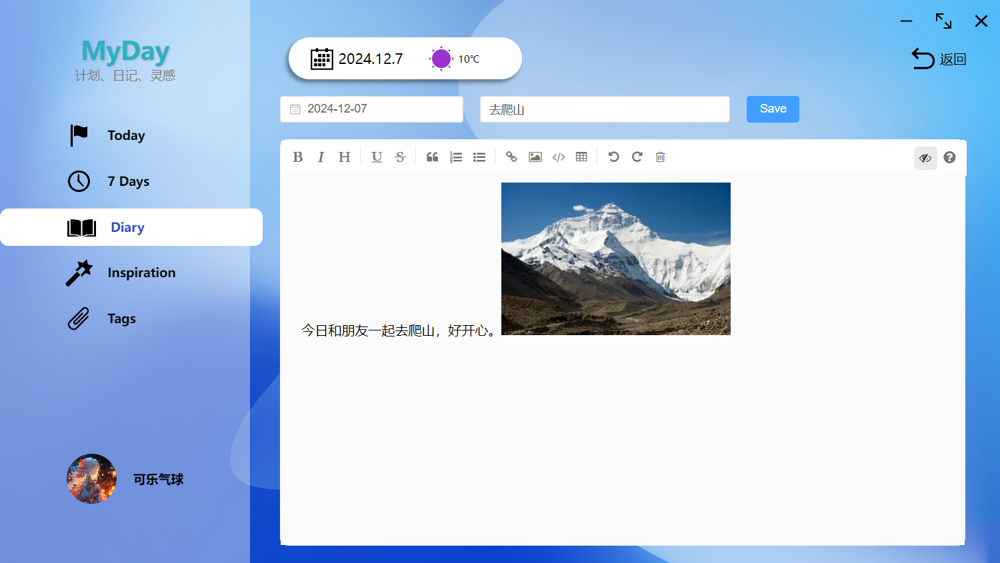
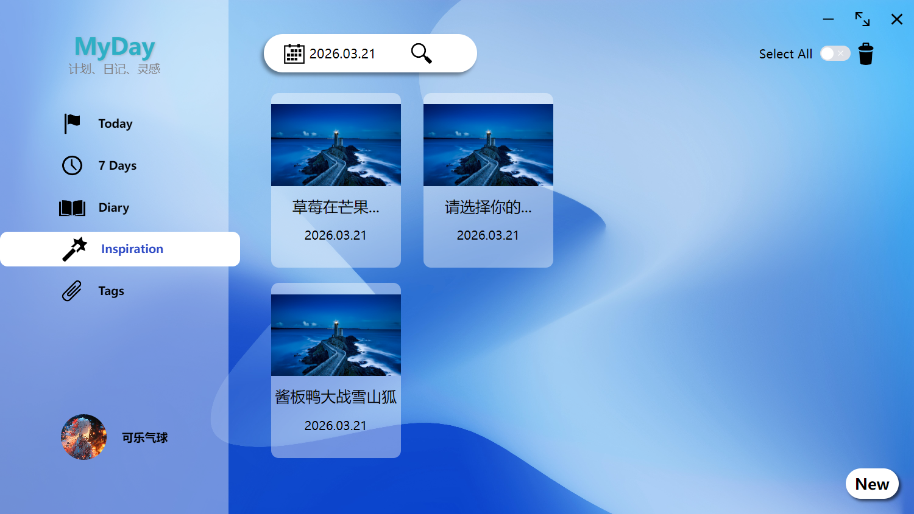
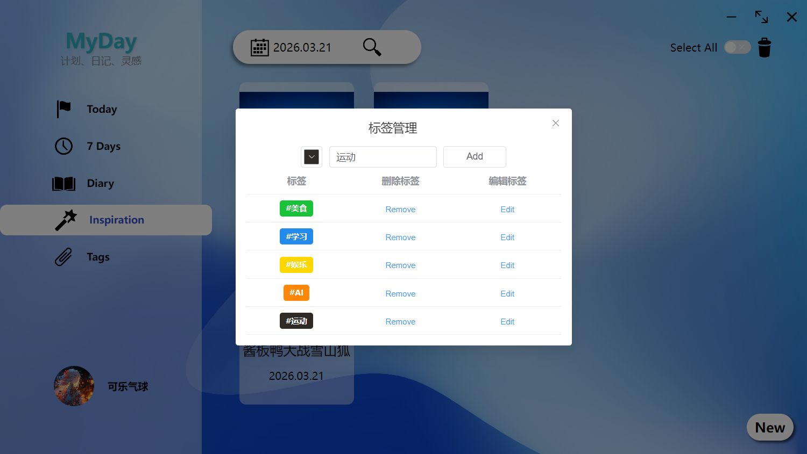
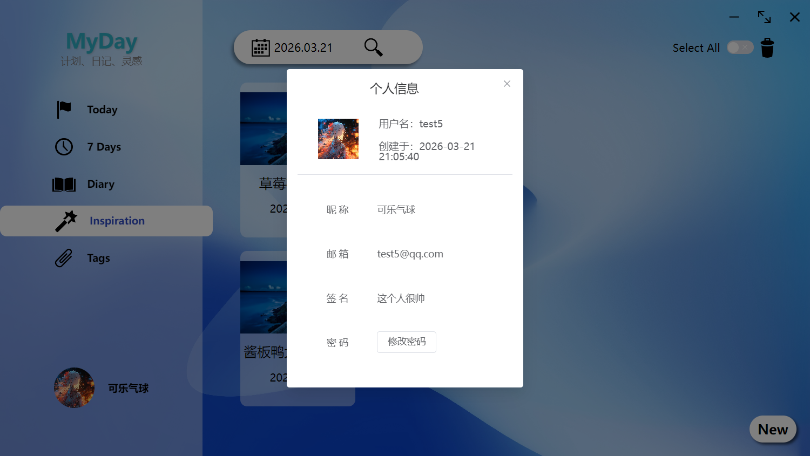

# MyDay

一个基于 **Electron + Vue 3** 的桌面端个人效率应用，聚合 **计划管理、日记记录、灵感速记、标签整理** 等功能，面向个人日常信息管理场景。

> 前端仓库：<https://github.com/Flycan-Fanc/MyDay>
> 后端仓库：<https://github.com/Flycan-Fanc/MyDay_backend>

---

## 项目概述

`MyDay` 是我独立完成的桌面端项目，目标是将计划、记录、整理三类高频需求整合到同一应用中，提升日常信息管理效率。

项目采用 **Electron + Vue 3** 构建桌面端界面，并配套 **Node.js + Express + MySQL** 后端，为后续账号体系、数据同步和内容扩展预留能力。

---

## 核心功能

- **计划管理**：支持今日视图与一周视图，便于安排与追踪日常任务
- **日记模块**：支持 Markdown 编辑与内容查看，用于记录复盘和思考
- **灵感速记**：用于保存碎片化想法与待整理内容
- **标签管理**：通过标签聚合不同模块内容，提升检索与归类效率

---

## 技术栈

### 前端 / 桌面端

- Electron
- Vue 3
- Vue Router
- Vuex
- Element Plus
- Axios
- electron-store
- mavon-editor
- electron-vite
- electron-builder

### 后端

- Node.js
- Express
- MySQL
- JWT
- Multer

---

## 项目亮点

### 1. 桌面端效率工具实践

基于 Electron 实现跨平台桌面应用，而不是停留在普通 Web 页面练习，更贴近日常真实使用场景。

### 2. 多模块统一整合

将计划、日记、灵感、标签等功能整合到同一产品中，体现了基础的产品设计与模块拆分能力。

### 3. 前后端完整联动

除了前端桌面应用外，还独立搭建了 Express + MySQL 后端，覆盖接口设计、联调与数据组织流程。

### 4. 结构化状态管理

前端状态按 `user / plan / tag / diary / inspiration / picture / weather` 等模块拆分，便于后续维护和扩展。

---

## 我负责的内容

- 项目需求构思与功能拆分
- Electron + Vue 3 技术选型与工程搭建
- 页面开发、路由组织、状态管理实现
- Markdown 日记编辑能力接入
- 前后端接口联调与后端基础服务搭建
- 标签化内容组织与扩展能力预留

---

## 本地运行

### 前端

```bash
git clone https://github.com/Flycan-Fanc/MyDay.git
cd MyDay
npm install
npm run dev
```

### 构建

```bash
npm run build:win
npm run build:mac
npm run build:linux
```

### 后端

```bash
git clone https://github.com/Flycan-Fanc/MyDay_backend.git
cd MyDay_backend
npm install
npm run dev
```

---

## 项目运行截图

- 用户登录页

> 登录页界面展示：实现自定义视觉布局，并完成 Electron 原生标题栏去除与窗口头部重设计。
- 今日计划页

- 一周视图页

- 日记编辑页

- 灵感管理页

- 标签管理页

- 用户信息管理页


---

## 后续优化方向

- 完善本地与云端同步能力
- 补充项目截图与演示说明
- 优化 UI 细节与交互体验
- 增加更完整的用户体系与数据管理能力

---

## License

GPL-3.0
